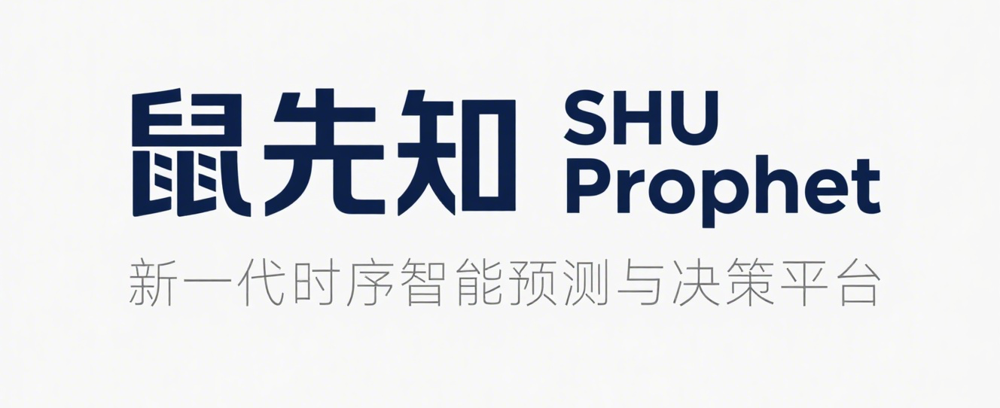

# 鼠先知 (SHU Prophet)

<div align="center">
  

<p>
    <strong>基于团队自研算法的时间序列智能分析平台</strong>
  </p>

<p>
    <a href="https://github.com/William-Liwei/shuprophet/stargazers">
      
    </a>
    <a href="https://github.com/William-Liwei/shuprophet/network/members">
      
    </a>
    <a href="https://github.com/William-Liwei/shuprophet/issues">
      
    </a>
    <a href="https://github.com/William-Liwei/shuprophet/blob/main/LICENSE">
      
    </a>
  </p>

<p>
    
    
    
    
  </p>
</div>

## ⭐ Star History

<div align="center">
  <a href="https://star-history.com/#William-Liwei/shuprophet&Date">
    
  </a>
</div>

---

## 📖 项目简介

**鼠先知 (SHU Prophet)** 是一个集成了多个自研时间序列预测算法的Web应用平台。平台的核心模型均来自团队在国际会议上发表的学术成果，旨在将前沿的时序分析技术以可视化、易用的方式呈现给研究者和开发者。

### 🎓 学术成果

平台集成的6个预测模型全部基于团队的原创研究，已发表于CCF推荐的国际学术会议：

- **2篇 CCF-B 类会议论文** (ICASSP 2026)
- **4篇 CCF-C 类会议论文** (ICANN 2025, ICIC 2025)

这些模型涵盖了小波变换、散射变换、状态空间模型、扩散模型等多种前沿技术，在多个公开数据集上取得了不错的预测效果。

## 💡 为什么选择鼠先知？

### 🎯 零门槛上手

- **无需编程基础**：通过Web界面即可使用，无需编写代码
- **无需统计学背景**：AI助理自动分析数据特征，生成易懂的分析报告
- **拖拽式操作**：上传CSV文件即可开始分析，简单直观

### ☁️ 远程部署，随时访问

- **无需本地环境**：不需要配置Python、CUDA等复杂环境
- **无需高性能硬件**：模型推理在云端完成，普通电脑即可使用
- **跨平台支持**：支持Windows、macOS、Linux，甚至移动端浏览器
- **未来规划**：计划提供付费API服务，支持大规模时序预测任务

### 🔧 统一接口，便于科研

- **标准化数据格式**：统一的CSV输入输出格式，方便模型对比
- **一致的评估指标**：自动计算MAE、MSE等标准指标，确保公平对比
- **可扩展架构**：研究者可轻松添加新模型到平台进行对比验证
- **可复现性**：所有预测结果可导出，便于论文撰写和实验复现

### 📊 强大的可视化能力

- **交互式图表**：基于ECharts的动态图表，支持缩放、筛选、导出
- **多模型对比**：在同一视图中对比多个模型的预测效果
- **性能排名**：自动计算并展示各模型的性能排名
- **专业报告**：AI自动生成图文并茂的分析报告

## 🔬 集成模型

平台集成了6个自研时间序列预测模型，均已发表于CCF推荐的国际学术会议。所有论文均由**黎玮（Wei Li）**作为第一作者完成。

### CCF-B 类会议论文

| 模型                    | 会议   | 年份 | 核心技术                     | 第一作者 |
| ----------------------- | ------ | ---- | ---------------------------- | -------- |
| **ScatterFusion** | ICASSP | 2026 | 层级散射变换，宏微观融合预测 | Wei Li   |
| **AWGFormer**     | ICASSP | 2026 | 自适应小波引导Transformer    | Wei Li   |

### CCF-C 类会议论文

| 模型                       | 会议  | 年份 | 核心技术                 | 第一作者 |
| -------------------------- | ----- | ---- | ------------------------ | -------- |
| **EnergyPatchTST**   | ICIC  | 2025 | 序列分块与不确定性量化   | Wei Li   |
| **SWIFT**            | ICANN | 2025 | 状态空间与扩张卷积融合   | Wei Li   |
| **LWSpace**          | ICIC  | 2025 | 小波分解与选择性状态空间 | Wei Li   |
| **TimeFlowDiffuser** | ICANN | 2025 | 层级式扩散框架           | Wei Li   |

### 模型特点

- **ScatterFusion**: 利用散射变换提取多尺度不变特征，适合处理非平稳时间序列
- **AWGFormer**: 结合小波分解和Transformer注意力机制，擅长捕捉长期依赖关系
- **EnergyPatchTST**: 专为能源领域设计，支持不确定性量化，提供预测置信区间
- **SWIFT**: 轻量级模型，适合边缘设备部署，推理速度快
- **LWSpace**: 融合小波卷积和状态空间模型，平衡精度和效率
- **TimeFlowDiffuser**: 基于扩散模型，可用于数据生成和缺失值修复

## 👥 团队介绍

**鼠先知**由上海大学计算机工程与科学学院的本科生团队开发和维护：

<div align="center">

| 姓名                           | 角色                  | 贡献                                |
| ------------------------------ | --------------------- | ----------------------------------- |
| **黎玮 (Wei Li)**        | 项目负责人 & 算法研发 | 6篇论文第一作者，核心算法设计与实现 |
| **王子欣 (Zixin Wang)**  | 前端开发              | 用户界面设计与交互优化              |
| **徐若轩 (Ruoxuan Xu)**  | 后端开发              | 服务架构与API设计                   |
| **杨哲涵 (Zhehan Yang)** | 全栈开发              | 系统集成与部署                      |

</div>

### 关于我们

我们是一群对时间序列分析充满热情的本科生。在导师的指导下，我们在过去的一年里完成了6篇学术论文的撰写和发表，并将这些研究成果转化为实用的Web应用。

虽然我们的研究还处于起步阶段，但我们希望通过这个平台，让更多人能够接触和使用前沿的时序预测技术。我们也期待与社区的交流和反馈，不断改进平台的功能和用户体验。

**联系方式**: liwei008009@163.com

## ✨ 核心功能

### 📊 模型性能可视化

- **多模型对比展示**: 在同一图表中对比多个预测模型的表现
- **性能指标计算**: 自动计算并展示MAE、MSE等评估指标
- **交互式图表**: 基于ECharts的动态图表，支持缩放、数据筛选等操作
- **性能排名**: 按预测精度自动排序，直观展示模型优劣

### 🤖 AI智能分析

- **数据特征分析**: 自动识别趋势、波动性、异常值和周期性
- **模型推荐**: 根据数据特征智能推荐适合的预测模型
- **分析报告生成**: 自动生成包含数据洞察和预测结果的专业报告
- **对话式交互**: 支持自然语言问答，解答用户关于模型和预测的疑问

### 📈 数据管理

- **CSV格式支持**: 标准CSV格式，兼容Excel、Python等工具
- **数据预处理**: 自动处理缺失值、异常值等数据质量问题
- **数据可视化**: 原始数据的趋势图、分布图等多种可视化方式

## 🚀 快速开始

### 环境要求

- **Python** >= 3.9
- **Node.js** >= 16
- **pip** & **npm**

### 1. 克隆项目

```bash
git clone https://github.com/William-Liwei/shuprophet.git
cd shuprophet
```

### 2. 后端启动

```bash
# 进入后端目录
cd backend

# 创建虚拟环境（推荐）
python -m venv venv
# Windows: venv\Scripts\activate
# macOS/Linux: source venv/bin/activate

# 安装依赖
pip install -r requirements.txt

# 配置环境变量
# 复制 .env.example 为 .env，并填入API密钥
cp .env.example .env

# 启动服务
python app.py
```

后端服务将运行在 `http://127.0.0.1:5000`

### 3. 前端启动

```bash
# 进入前端目录（新终端窗口）
cd frontend

# 安装依赖
npm install

# 启动开发服务器
npm run dev
```

前端应用将运行在 `http://localhost:5173`

## 🛠️ 技术架构

### 前端技术栈

- **框架**: Vue 3 + Vite
- **UI组件**: Element Plus
- **数据可视化**: ECharts
- **路由**: Vue Router
- **HTTP客户端**: Axios

### 后端技术栈

- **Web框架**: Flask
- **数据处理**: Pandas, NumPy
- **统计分析**: Scikit-learn, Statsmodels
- **AI集成**: LangChain, OpenAI-compatible APIs

### AI功能实现

- **统计分析**: 使用Python进行趋势检测、异常识别等计算
- **自然语言生成**: 使用LLM将分析结果转化为易读的报告
- **对话管理**: 基于LangChain的会话记忆和上下文管理

## 📚 使用说明

### 查看模型对比

1. 访问"科研成果探索"页面
2. 选择数据集（如ETTh1_full.csv）
3. 系统自动加载并展示所有模型的预测结果
4. 查看性能对比图表和评估指标

### 使用AI分析

1. 访问"智能助手"页面
2. 上传自己的时间序列数据（CSV格式）
3. AI助理自动分析数据特征并生成报告
4. 可通过对话进一步询问分析细节

### 查看算法详情

1. 访问"算法文库"页面
2. 浏览各模型的技术细节和论文信息
3. 查看BibTeX引用格式

## 📁 项目结构

```
shuprophet/
├── backend/
│   ├── models/
│   │   ├── agent_chain.py          # AI助理核心逻辑
│   │   ├── prediction_tool.py      # 预测分析工具
│   │   └── arima_predictor.py      # ARIMA基线模型
│   ├── static_data/
│   │   └── research_datasets/      # 预测数据集
│   ├── app.py                      # Flask主应用
│   └── requirements.txt
│
├── frontend/
│   ├── src/
│   │   ├── components/             # Vue组件
│   │   ├── views/                  # 页面视图
│   │   ├── router/                 # 路由配置
│   │   └── assets/                 # 静态资源
│   └── package.json
│
└── README.md
```

## 📄 许可证

本项目采用 Apache License 2.0 许可证。详见 [LICENSE](LICENSE) 文件。

## 🤝 贡献

欢迎提交Issue和Pull Request！如果你有任何建议或发现了bug，请随时联系我们。

## 📮 联系我们

- **项目负责人**: 黎玮 (Wei Li)
- **邮箱**: liwei008009@163.com
- **学校**: 上海大学 计算机工程与科学学院

---

<div align="center">
  <p>
    <strong>如果这个项目对你有帮助，请给我们一个 ⭐ Star！</strong>
  </p>
  <p>
    <em>Time Series Forecasting Research Platform by SHU Undergraduates</em>
  </p>
</div>
